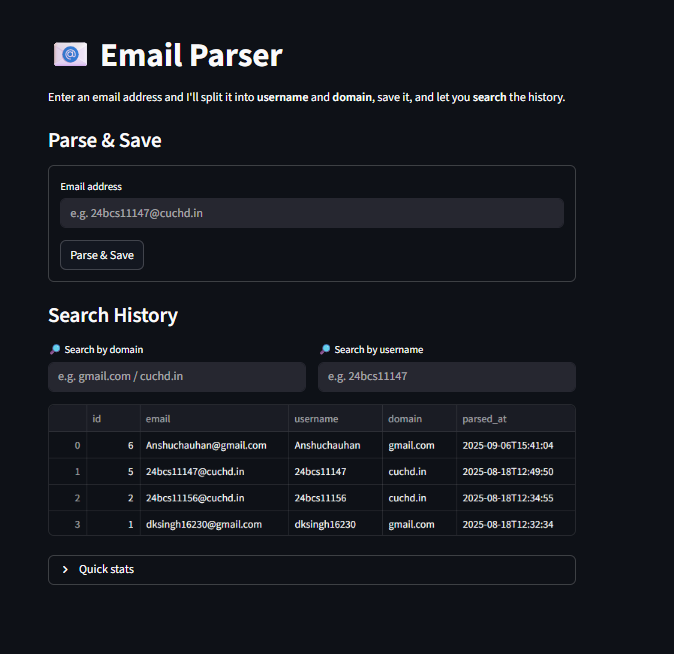

# Email Parser Application

A web-based application built with Python and Streamlit that allows users to parse email addresses into their respective usernames and domains.

## Features
- Automated email slicing (username and domain extraction)
- Real-time input validation
- Interactive web interface

## Demo
### Application Screenshot

## Tech Stack
- Language: Python
- Framework: Streamlit

## Project Structure
- app.py: Main application logic
- requirements.txt: List of dependencies
- email.png: Application screenshot
- emails.db: Local database storage

## How to Run
1. Clone the repository
2. Install dependencies: pip install -r requirements.txt
3. Run the app: streamlit run app.py
